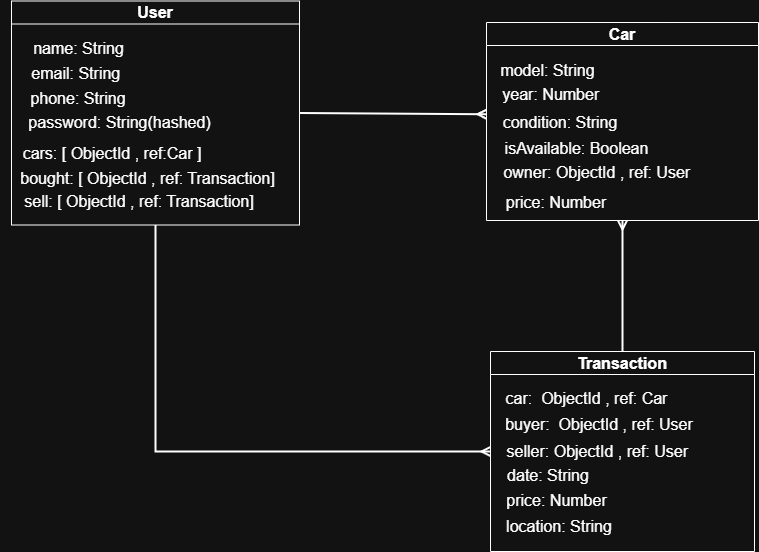
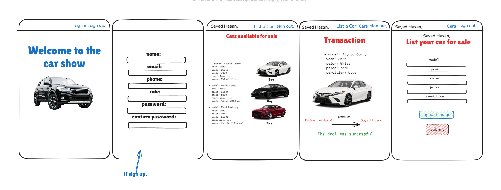

# Car App

[User-Stories](./planning-materials/User-Stories.md)

## Description

This is a car management application that allows users to manage cars and transactions.

## How to Run

1.  Clone the repository.
2.  Install dependencies: `npm install`
3.  Start the server: `npm start`
4.  Open the application in your browser at `http://localhost:4000`

## File Structure

*   **controllers**: Contains the route handlers for the application.
    *   `authController.js`: Handles authentication routes.
    *   `carController.js`: Handles car routes.
    *   `tranController.js`: Handles transaction routes.
    *   `userController.js`: Handles user routes.
*   **db**: Contains the database connection.
*   **models**: Contains the database models.
    *   `Car.js`: Car model.
    *   `Transaction.js`: Transaction model.
    *   `User.js`: User model.
*   **routes**: Contains the routes for the application.
    *   `authRouter.js`: Authentication routes.
    *   `carRouter.js`: Car routes.
    *   `tranRouter.js`: Transaction routes.
    *   `userRouter.js`: User routes.
*   **styles**: Contains the CSS styles for the application.
    *   `style.css`: CSS styles.
*   **views**: Contains the EJS templates for the application.
    *   `auth`: Authentication templates.
    *   `cars`: Car templates.
    *   `transactions`: Transaction templates.
    *   `users`: User templates.
    *   `index.ejs`: Index template.
*   `.env`: Contains the environment variables.
*   `.gitignore`: Specifies intentionally untracked files that Git should ignore.
*   `package-lock.json`: Records the exact versions of dependencies used in the project.
*   `package.json`: Contains metadata about the project, such as the name, version, and dependencies.
*   `README.md`: This file, providing information about the project.
*   `server.js`: The main entry point for the application.
